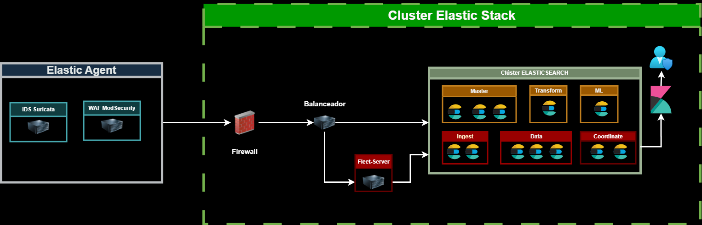
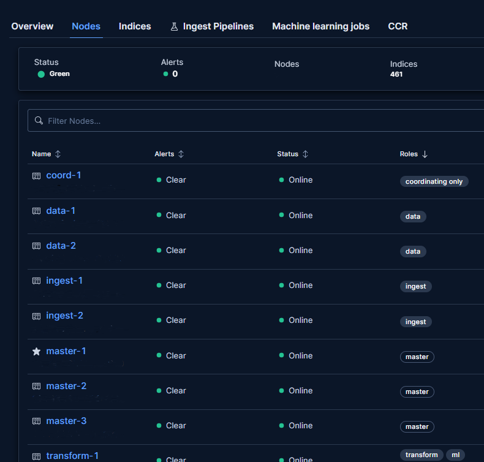

# Enterprise Air-Gapped Elastic Stack SIEM Cluster

Despliegue e implementación de un clúster de Elastic Stack 9.5.4 en arquitectura distribuida para entornos con conectividad limitada o restringida (Air-Gapped). La arquitectura separa formalmente las funciones del clúster e integra Fleet Server y Nginx como capa de balanceo.

## Arquitectura de Red y Topología

| Rol de Nodo | Cantidad | Función Principal |
| :--- | :--- | :--- |
| Master Dedicated | 3 | Gestión del estado del clúster y quórum. Sin indexación de datos. |
| Data | 3 | Almacenamiento e indexación. Aplicación de políticas ILM. |
| Ingest Dedicated | 2 | Ejecución de Ingest Pipelines, parseo Grok y normalización a ECS. |
| Coordinate Dedicated | 2 | Enrutamiento de consultas y agregación de búsquedas. |
| Transform | 1 | Tablas pivote continuas. |
| ML | 1 | Analítica de métricas. |
| Fleet | 1 | Gateway para agentes Elastic Agent. |
| Nginx Proxy | 1 | Balanceo de carga L7 |

## Flujo de Ingesta y Normalización

1. Captura: Los puntos finales y dispositivos de red envían telemetría o métricas a los agentes Elastic Agent.
2. Gateway: Nginx recibe el tráfico y distribuye la carga entre los nodos Ingest.
3. Parseo Nativo: Los Ingest Nodes procesan los eventos mediante syslog-firewall-pipeline.json, mapeando los campos a Elastic Common Schema (ECS 8.x) (source.ip, destination.ip, event.dataset).
4. Almacenamiento: Los datos procesados se escriben en los nodos Data según las políticas de Lifecycle Management (ILM).

